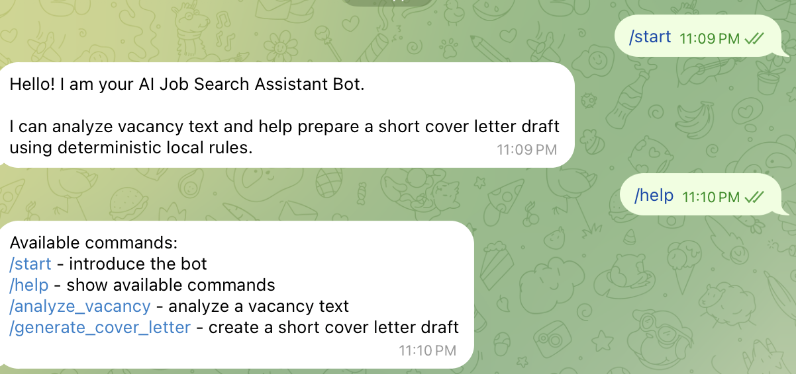
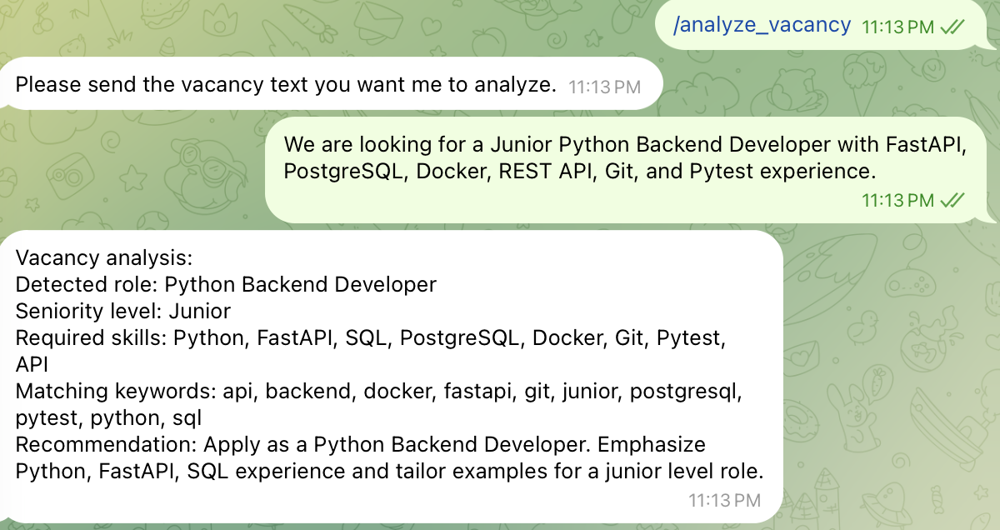
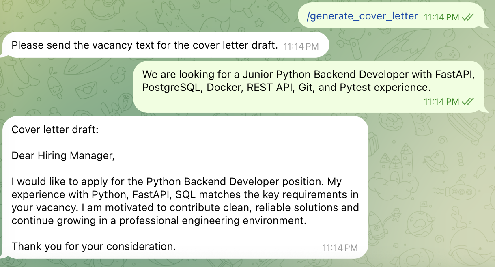

# AI Job Search Assistant Bot

A production-style Telegram bot foundation for AI-style job search assistance.
The bot can analyze vacancy text and generate a short professional cover letter
draft using deterministic local logic.

This project is built as a portfolio project for a Junior Python Backend
Developer / AI Automation Engineer role. It demonstrates async Python,
aiogram-based bot structure, clean service-layer separation, environment-based
configuration, tests, Docker, Ruff, and GitHub Actions CI.

## Features

- Telegram command handlers built with aiogram.
- Vacancy text analysis with deterministic local rules.
- Short deterministic cover letter draft generation.
- Clean separation between handlers and business logic.
- Pydantic schema for vacancy analysis output.
- Environment variable configuration with `python-dotenv`.
- Tests that do not require Telegram API or external AI API credentials.
- Docker support for running the bot container.
- GitHub Actions CI for Ruff and Pytest checks.

## Bot commands

- `/start` - introduces the bot.
- `/help` - explains available commands.
- `/analyze_vacancy` - asks the user to send vacancy text for analysis.
- `/generate_cover_letter` - asks the user to send vacancy text for a cover
  letter draft.

## Screenshots

`/start` and `/help` commands:



Vacancy analysis flow:



Cover letter generation flow:



## Tech stack

- Python 3.13
- aiogram
- Pydantic
- python-dotenv
- Pytest
- Ruff
- Docker
- GitHub Actions

## Project structure

```text
app/
  bot/
    dispatcher.py
  handlers/
    commands.py
    states.py
  schemas/
    vacancy.py
  services/
    bot_responses.py
    cover_letter_generator.py
    vacancy_analyzer.py
  config.py
  main.py
tests/
  test_bot_responses.py
  test_cover_letter_generator.py
  test_main_startup.py
  test_vacancy_analyzer.py
.github/workflows/
  ci.yml
```

Business logic lives in `app/services/`. Telegram handlers stay thin and call
service functions for response text, vacancy analysis, and cover letter
generation.

## Environment variables

Create a local `.env` file for runtime configuration:

```env
BOT_TOKEN=your_telegram_bot_token_here
```

`BOT_TOKEN` is required only to run the real Telegram bot. Tests and CI do not
require Telegram credentials.

Security note: never commit `.env` or a real `BOT_TOKEN` to the repository.

## Local setup

Create and activate a virtual environment:

```bash
python -m venv .venv
source .venv/bin/activate
```

Install runtime and development dependencies:

```bash
python -m pip install --upgrade pip
python -m pip install -r requirements.txt -r requirements-dev.txt
```

Create a local environment file:

```bash
cp .env.example .env
```

Add your real Telegram bot token to `.env`, then run the bot:

```bash
python -m app.main
```

If `BOT_TOKEN` is missing, the app exits cleanly without starting polling.

## Docker setup

Build the bot image:

```bash
docker compose build
```

Run the bot container:

```bash
docker compose up bot
```

Docker Compose reads `BOT_TOKEN` from the local environment or `.env` file.
The Docker image installs runtime dependencies only.

## Tests and linting

Run Ruff:

```bash
python -m ruff check .
```

Run tests:

```bash
python -m pytest
```

The test suite covers deterministic services and startup behavior without
calling the Telegram API or any external AI API.

## CI

GitHub Actions runs on every push and pull request. The CI workflow uses Python
3.13, installs project dependencies, then runs:

```bash
python -m ruff check .
python -m pytest
```

CI does not require `BOT_TOKEN`.

## MVP note

The current MVP intentionally uses deterministic local AI-style logic instead of
OpenAI or another external LLM provider. This keeps the behavior predictable,
free to test, and suitable for demonstrating the service architecture. A real
LLM provider can be added later behind the same service layer.
